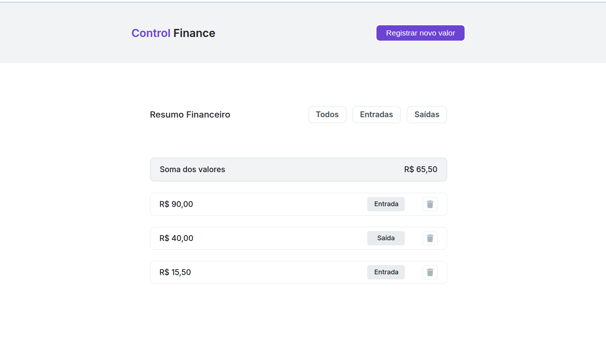

Control-Finance - Projeto responsivo de gerenciamento financeiro

## 📋 Descrição

Control-Finance é um projeto desenvolvido em CSS que permite cadastrar e excluir informações financeiras.

## 🚀 Tecnologias Utilizadas

- **HTML** - Linguagem de marcação de hipertexto
- **CSS** - Linguagem de estilo

## 🛠️ Como Executar

### Pré-requisitos
- IDEA compatível

### Passos para execução
1. Clone o repositório
2. Navegue até a pasta do projeto: `cd Control-Finance`
3. Execute o projeto em qualquer navegador através do live server

## 👨‍💻 Desenvolvido por

Este projeto foi desenvolvido por **[Mariana Milani Assunção](https://github.com/MariiMilani)** visando consolidar conceitos básicos de front-end em HTML e CSS.

## 🤝 Contribuições

Contribuições são bem-vindas! Sinta-se à vontade para abrir issues e pull requests.